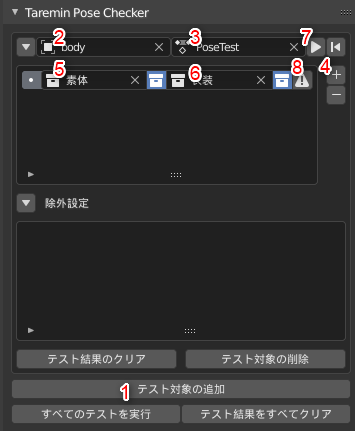
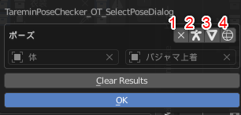

# Taremin Pose Checker

## なにこれ？

ポーズライブラリを利用して、各ポーズでオブジェクト同士が接触していないかチェックする Blender アドオンです。

## インストール

[Releases](./releases) から最新の zip をダウンロードして、「ファイル」「ユーザー設定」「アドオン」「ファイルからアドオンをインストール」を選択し、ダウンロードした zip ファイルをインストールします。

## 使い方

### 基本

まず、このアドオンは「アーマチュア」「ポーズ」「オブジェクト２つ」を指定してオブジェクト間で接触していないか確認します。

上記の画像をもとに基本的な使用方法を説明します。

1. テスト対象の追加
  - テスト対象とは、上記の3要素のうち、「アーマチュア」と「ポーズライブラリ」をひとまとめのグループとして扱うものです
2. チェック対象のアーマチュアを指定します
3. チェックに使用するポーズライブラリを指定します
4. チェック対象のオブジェクト(またはコレクション)を追加します
5. チェック対象1を設定します
  - この図のように、隣のコレクションアイコンをクリックするとコレクションを対象にできます
6. チェック対象2を設定します
7. このボタンを押すと、この「アーマチュア」と「ポーズライブラリ」内で接触するオブジェクトがないかチェックします
  - 別の Blender プロセスでチェックを行いますが、これはチェック前に一時的なオブジェクトを生成するなどでヒストリに大量のオブジェクトがのこりメモリを大量に消費してしまうのを防ぐためで、並列処理でチェックを行い高速化するなどの意図はありません
8. 接触しているオブジェクトがあった場合、ここのアイコンが画像の用に `!` に変わります
  - このアイコンをクリックすると接触している対象のオブジェクトとポーズを参照できます

### 特定のポーズで接触していた場合の確認方法

上記の `8` のアイコンをクリックすると以下のようなダイアログが表示されます。

接触したときの「ポーズ名」「オブジェクト1」「オブジェクト2」が表示されます。
ここで使用できる4つのボタンについて説明します。

1. この接触結果を無視するようにします
  - 結果から削除され、メインの設定画面の除外設定に追加されます
  - これは事前にわかっていて許容する接触を見ないで済むようにするための機能です
2. 対象オブジェクトとアーマチュアのみを表示するようにします
3. `2` のアーマチュアを表示しない設定です
4. `3` をワイヤーフレーム表示で編集モードにします
  - これは接触箇所の面が選択状態になっていてわかりやすいです

## ライセンス

[MITライセンス](./LICENSE)

## 連絡先

Twitter: [@Taremin_VR](https://twitter.com/Taremin_VR) までお気軽に連絡ください。
要望や不具合報告などは Issues か Twitter どちらでもお気軽にどうぞ。